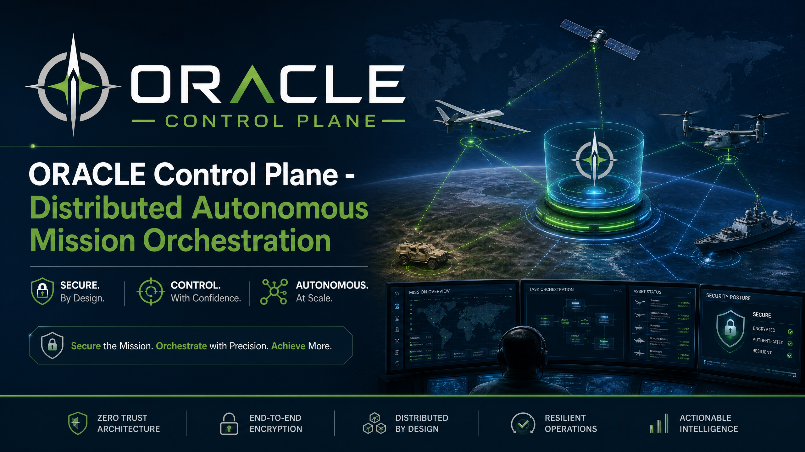
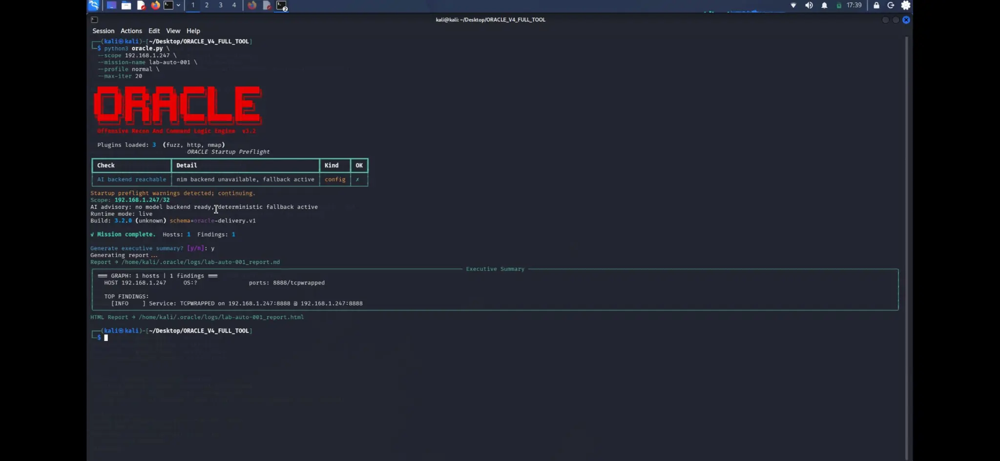
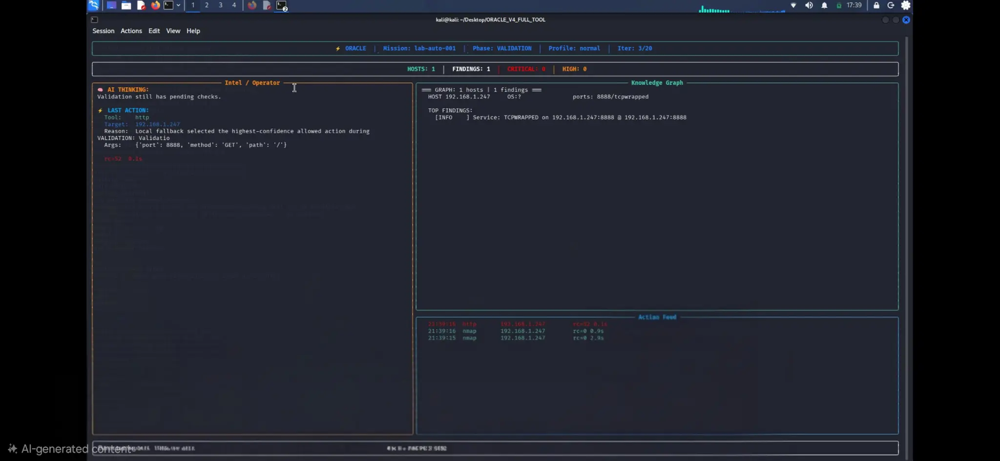
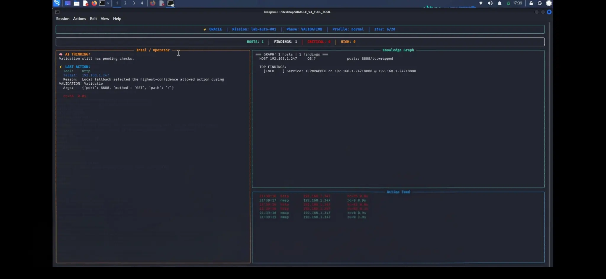

<div align="center">



# ORACLE

**Deterministic Mission Orchestration for Authorized Security Testing.**

A planner — not an LLM — decides what happens next. AI is advisory only.
Every action is scope-guarded, risk-classified, and evidence-graphed.

[](https://github.com/Panda1847/oracle-mission-control/actions)
[](LICENSE)
[](requirements.txt)
[](runtime-go/go.mod)
[](https://github.com/Panda1847/oracle-mission-control)

[Quick Start](#quick-start) • [Architecture](#architecture) • [Editions](#editions) • [Docs](docs/) • [Contributing](CONTRIBUTING.md)

</div>

---

## Editions

ORACLE is available in three tiers. **This repository is the Free Community Edition** — fully functional, open-source, and MIT-licensed. Pro and Enterprise tiers add cloud-scale infrastructure, advanced compliance reporting, and dedicated support.

| Feature | Free Community | Pro | Enterprise |
|---|:---:|:---:|:---:|
| Deterministic Planner | ✅ | ✅ | ✅ |
| Scope Guard & Approval Engine | ✅ | ✅ | ✅ |
| Manifest-Driven Plugin SDK | ✅ | ✅ | ✅ |
| Evidence Graph | Local | Cloud Sync | Distributed |
| Execution Workers | Single Node | Multi-Node | Unlimited Scale |
| Compliance Reporting | Basic | Advanced | Custom Templates |
| Approval Engine | Manual | Rule-Based | RBAC & SSO |
| Audit Log Replay | ✅ | ✅ | ✅ |
| Support | Community | Priority Email | 24/7 Dedicated SLA |

> For Pro and Enterprise licensing, contact the sales team.

---

## What ORACLE is

ORACLE is a mission-orchestration platform for **authorized** security assessments. It runs recon and testing plugins against a scope you explicitly define, tracks every finding in a provenance-aware evidence graph, and produces reports you can hand to a client or a compliance team — all while keeping a deterministic state machine, not a language model, in control of what actually happens.

**Deterministic planner.** Mission phases, retries, fallbacks, and completion are decided by an explicit state machine. AI can suggest a next action; it can never take one outside the set the planner already considers legal, and it can fail entirely without stalling the mission.

**Scope guard & approval engine.** Every action is checked against an explicit target scope and classified by risk before it runs. Higher-risk actions can require operator approval.

**Evidence graph.** Hosts, services, and findings are stored as a graph with provenance, confidence scoring, TTL decay, and contradiction detection — not a flat log you have to reconstruct by hand.

**Isolated execution.** Plugin commands run through a Go execution runtime and worker dispatch layer with timeouts and sandboxing, not directly in the orchestrator process.

**Replayable missions.** Every mission can be replayed from its audit log and artifact snapshots for after-action review.

---

## In Action

**Startup & mission report** — ORACLE preflight, scope confirmation, live execution, and auto-generated executive summary:



**Live 5-panel dashboard** — AI thinking panel, Knowledge Graph, and Action Feed updating in real time during a VALIDATION phase:





---

## Quick Start

```bash
python3 -m pip install -r requirements.txt
python3 -m pip install -e .
cd runtime-go && go test ./... && cd ..
python3 -m pytest -q
python3 -m oracle --demo --web --web-port 5000
```

Then open `http://127.0.0.1:5000`.

### Run against a real scope

```bash
python3 -m oracle --scope 192.168.1.0/24 --mission-name lab-001 --max-iter 20 --report
```

`--scope` is mandatory for any non-demo run and is enforced by the scope guard on every action — ORACLE will not act outside it.

### Free, fully local AI (no API key required)

```bash
ollama pull llama3.2:3b
export ORACLE_AI_BACKEND=ollama
python3 -m oracle --scope 192.168.1.0/24 --max-iter 20 --report
```

If Ollama is unavailable, ORACLE continues in deterministic planner-only mode — the AI layer is advisory and optional by design.

---

## Architecture

ORACLE is organized around five runtime planes:

| Plane | Responsibility |
|---|---|
| **Control** | Mission state, operator approvals, dashboards, APIs |
| **Decision** | Deterministic planner + policy system choose legal next actions |
| **Execution** | Go runtime + worker dispatch run plugin commands with isolation/timeouts |
| **Intelligence** | Evidence graph: hosts, services, findings, provenance, confidence, contradictions |
| **Assurance** | Telemetry, audit, config validation, test harnesses, reporting |

Failure containment is a first-class design goal, not an afterthought. If advisory AI fails, the planner still chooses a legal action. If a remote worker fails, the dispatcher falls back to the local worker. If a queue consumer fails, the message goes to the dead-letter queue instead of halting the mission loop. If reporting fails, the mission snapshot artifact still persists.

Full write-up: [`docs/architecture.md`](docs/architecture.md).

---

## Repository Layout

```text
oracle/          # installable package: CLI, web control plane, core engine
core/            # enterprise layer: planner, policy, orchestrator, ai, reporting
queuebus/        # message bus, consumers, replay stream, dead-letter queue
memory/          # evidence graph intelligence
security/        # signing, vault, sandbox, mTLS, binary verification
storage/         # metadata, snapshots, artifacts, rollback
telemetry/       # metrics, tracing, health, dashboards
workers/         # distributed worker nodes
runtime-go/      # concurrent execution microservice (Go)
plugins/         # manifest-driven capability plugins (nmap, http, fuzz)
api/             # operator REST API
web/             # control-plane frontend + gateway
tests/           # unit, integration, replay, chaos
docs/            # architecture, API reference, plugin SDK, security, deploy docs
```

---

## Verification

```bash
make ci
```

Runs Python unit/integration/replay/chaos tests, Go runtime tests, and compile validation across every enterprise module.

---

## Plugin SDK

Plugins are manifest-driven, not hardcoded tool names — see [`docs/plugin_sdk.md`](docs/plugin_sdk.md) to add your own recon or testing capability without touching the core engine.

---

## Responsible Use

ORACLE is built for testing systems you are explicitly authorized to test. The scope guard exists to make unauthorized use harder by default, not to make it impossible to misuse deliberately — that responsibility sits with the operator. See [`docs/security.md`](docs/security.md) and [`SECURITY.md`](.github/SECURITY.md).

---

## Contributing

See [`CONTRIBUTING.md`](CONTRIBUTING.md). Issues and PRs welcome — especially plugin contributions using the SDK above.

## License

[MIT](LICENSE)
